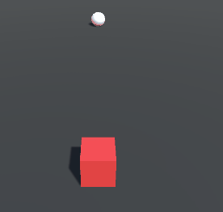

# Behaviour Tree Library

This C# library contains everything required to create a **BehaviourTree AI** easily.

## Introduction

Our library is mainly based on two main classes that are the foundation of the BehaviourTree's structure.

### The Tree class

The first class is the class `Tree`. This is the class that will contain the entire structure of the BehaviourTree.
It's by creating a `Tree` that we'll define the flow of decisions.

### The Node class
The second class is the class `Node`. Every element contained inside our `Tree` inherits from `Node`.
Every node is defined by a `NodeState`, called `currentState`.
There are 4 possible states :
- `NotExecuted` : the node is in its initialized state and had never been run.
- `IsRunning` : the node is currently running,
- `Success` : the node obtained a successful result (i.e completing an attack or a condition is true)
- `Failed` : the node either failed to run its behaviour or if it's a condition, the condition was false.

Those nodes are divided in **3 main categories** :
- **The control nodes**. They control the exploration of the tree in order to pick which action or condition will be executed. Here is the list of the available control nodes:
  - `Selector`, equivalent to an **OR** operator, as it will be considered in **Success** as soon as one of its children is in **Success** too.
  - `Sequence`, equivalent to a **AND** operator, as it will be considered in **Success** only if all of its children are in **Success**.
  - `Inverter`, equivalent to a **NOT** operator, its state is **Success** when its child is **Failed** and is **Failed** when its child is **Success**.
  - `ForceFailure`, which will always be set to **Failed**.
  - `ForceSuccess`, which will always be set to **Success**.
- **The action nodes**. They contain some code to run when the behaviour tree decides that this node is the current node. We have created 2 action nodes as an example :
  - `Log` which adds a message in the console as a Debug.Log. Really useful when you need to check if your behaviour tree explores a specific branch.
  - `Wait` delays the next actions to perform (i.e inside a Selector node).
- **The condition nodes**. They are used to check a certain information in order to change the behaviour of the tree.

As our library supports class inheritance, the user **can create its own nodes** by inheriting the base class of its choice.


## Example

### Custom Tree example
Here is how to create a custom tree. For or demo purpose, we will make a simple Tree that will:
1. Log `Hello World!`
2. Wait for 1 second
3. Log `Hello Country!`
4. Wait for 2.5 seconds
5. Repeat from step 1

First we'll to create your custom tree. Ours will be called TestTree :
``` c#
public class TestTree : Tree{
[...]
}
```
Then we need to override the function SetupTree, that will be called when the Tree will setup itself.
``` c#
protected override Node SetupTree()
    {
[...]
}
```
Then we will create our 4 actions, 2 Wait nodes and 2 Log nodes.
``` c#
Log logWorld = new Log("Hello World!");
Log logCountry = new Log("Hello Country!");
Wait waitAfterWorld = new Wait(1.0f);
Wait waitAfterCountry = new Wait(2.5f);
```
In order to let the Tree execute those actions in the desired order, we need to encapsulate them inside a `Sequence` node. As the Sequence node takes a children node parameter, we will order our nodes in a List of Nodes :
``` c#
Sequence mySequence = new Sequence(new List<Sequence>{logWorld, waitAfterWorld, logCountry, waitAfterCountry};
```
We are now done initializing, we just need to return our sequence at the end of `SetupTree()` :
``` c#
return mySequence;
```

### Custom Action and Condition example
As making a custom Tree can be quite limiting when only using Log and Wait nodes, if we want to make complex behaviours, we need to create our own nodes.

For our second demo, we will create two nodes:
- An Action node, _MoveForward_, that will move the cube attached to the tree;
- A condition node, _CheckDistance_, that will check if the cube is close to an other object in our scene.

#### MoveForward
As MoveForward will be an Action, it needs to inherit from Action. Also, we will include all our required parameters.

```c#

public class MoveForward : Action
{
    
    private CubeController cubeController;
    private float moveDuration = 1f;
    private float movingSpeed = 5f;
    private float startMovingTime;
    private bool isMoving;
    [...]
}
```
We'll then add our constructor, in order to get our parameters. As you can see, you can specify a node name, that can be used to know where you are currently in the Tree.
```c#
public MoveForward(CubeController cubeController, float moveDuration, float movingSpeed) : base("Move Forward")
{
    this.cubeController = cubeController;
    this.moveDuration = moveDuration;
    this.movingSpeed = movingSpeed;
}
```
As an Action, you can override 3 functions :
- **OnStart**, which will be called when the node will change from NotExecuted to Running,
- **OnUpdate**, which will be called everytime the action is running,
- **OnEnd**, which will be called after the Node is set to Success or Failed.

We'll begin by overriding the method OnStart. Inside, we'll reset our values :
```c#
public override void OnStart()
{
    base.OnStart();
    startMovingTime = Time.time;
    isMoving = true;
}

```
Then we'll override OnUpdate, where our action will be performed :
```c#
public override void OnUpdate(float elapsedTime)
{
    cubeController.Move(cubeController.transform.forward, movingSpeed*elapsedTime);
    
    float movingElapsed = Time.time - startMovingTime;
    if (isMoving && movingElapsed >= moveDuration)
    {
        state = NodeState.Success;
    }
}
```

Finally, when the state of Tree's root is Success, the tree resets all the nodes to start once again exploring the tree from the root. In our case, we need to `isMoving` to false.

We can override Reset to do that : 
```c#
public override void Reset()
{
    base.Reset();
    isMoving = false;
}
```

#### CheckDistance

For a condition, it's basically the same as an action exept it will inherit from Condition instead. The rest is almost the same.
In our case, we will compare two transforms to check if they are close enough :
```c#
public override void OnUpdate(float elapsedTime)
{
    if (Vector3.Distance(firstTransform.position, secondTransform.position) < distance)
    {
        state = NodeState.Success;
    }
    else
    {
        state = NodeState.Failed;
    }
}
```

### Usage of Selector node

Finally, we will change our SetupTree, in order to change our behaviour.
As we need want our cube to move forward only when its distance from the target is to small and to jump when its close to it, we need to use our first Selector.

We will first declare our new nodes : 

```c#

MoveForward moveForward = new MoveForward(cubeController, 1, 2);
JumpAction jump = new JumpAction(cubeController, jumpingForce);
CheckDistance dist = new CheckDistance(this.transform, target);
```
Then we will create a Sequence that begins with our CheckDistance, as we don't want to do the following actions unless CheckDistance is Success.

```c#
Sequence sequence = new Sequence(new List<Node> { dist, jump }, identifier);
```

Finally, we want to encapsulate our Sequence inside a Selector, to choose an action, moveForward in our case, if our Sequence cant be executed :
```c#
Selector selec = new Selector(new List<Node> { sequence, moveForward }, identifier);
```

### AIUpdater
In order to let nodes perform their actions, you need to add in your scene a AIUpdater, which is a singleton that will call OnUpdate of the currentNode of all AIs in the scene at a given rate.

### Result

As a result, we now have a cube that goes forward as long as its target is not in range, and that jumps when its target is close enough.
<p align="center">
  
</p>
